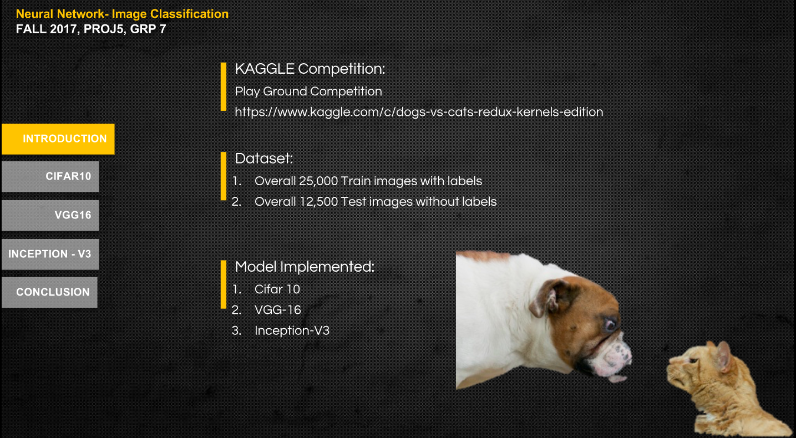
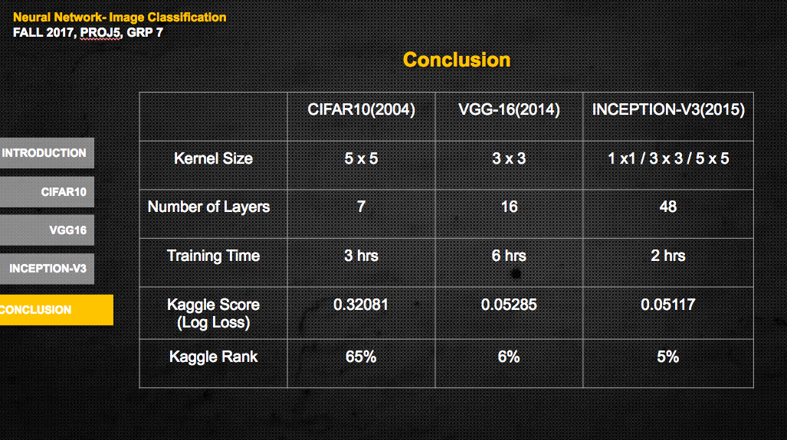

# ADS Project 5: 


Term: Fall 2017

+ Team # Group 7
+ Projec title: Project 5: Image Classification using Neural Network
+ Team members
	+ Chenyun Wu
	+ Fan Gong
	+ Hongjie Ren(Presenter)
	+ Qihang Li
	+ Yingbin Jiang

+ Main File Link : [Click Here](https://github.com/TZstatsADS/Fall2017-project5-grp7/blob/master/doc/main.pdf)
+ Presentation Slides Link : [Click Here](https://github.com/TZstatsADS/Fall2017-project5-grp7/blob/master/doc/proj5-grp7.pptx)
	
+ Project summary: 



In this project, we use mutiple neural network model to do image recognition. Three models--Cifar 10, VGG-16 and Inception-V3 are implemented to classifiy 12500 cat/dog images. The prediction performance of three model has ranking of 65%, top 6.6%, top 5.3% in the Kaggle competition respectively. Based on that, we also compare the models and get some interesting findings of the results.

+ Project Conlusion  



* Kaggle Best Ranking 

Our best model ranked top 5.3% in kaggle competition, here are the screenshots:


	
**Contribution statement**: ([default](doc/a_note_on_contributions.md)) All team members contributed equally in all stages of this project. All team members approve our work presented in this GitHub repository including this contributions statement. 

Following [suggestions](http://nicercode.github.io/blog/2013-04-05-projects/) by [RICH FITZJOHN](http://nicercode.github.io/about/#Team) (@richfitz). This folder is orgarnized as follows.

```
proj/
├── lib/
├── data/
├── doc/
├── figs/
└── output/
```

Please see each subfolder for a README file.
