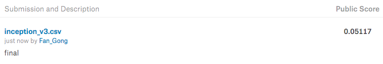
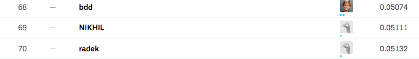

# DOG OR CAT?
## Project 5 - Group7 

###  Group Member: Fan Gong, Qihang Li, Chenyun Wu, Yingbin Jiang, Hongjie Ren

## Introduction 

In this project, we use mutiple neural network model to do image recognition. 

Three models--Cifar 10, VGG-16 and Inception-V3 are implemented to classifiy 12500 cat/dog images. The prediction performance of three model has ranked of top 65%, top 6.6%, top 5.3% in the Kaggle competition respectively. Based on that, we also compare the models and get some interesting findings of the results.

Here is our best ranking in Kaggle :



## Cifar 10 Model 

Here is the link for the Cifar 10 model folder: https://github.com/TZstatsADS/Fall2017-project5-grp7/tree/master/lib/CIFAR10 

There are three parts inside cifar10.py
1. Input data part, this part includes two functions: `get_files()` and `get_batch()`. These two functions are used to input files and package image to batch.
2. Model part, this part defined the inference function, loss function, optimization function and evaluation function totally four functions to run the convolutional neural network model.
3. Training part, this part input the data into model and created tensorflow session to display the training results. Please change the "train_dir" and "logs_train_dir" to the corresponding directory before running.

#### Training file
To start training the model, simply run the following code:
```
run_training()
```
#### Evaluate model
Since we have all the parameters now, then we can evaluate our results, the codes are following: 

```
cifar10_results=[]

for i in range(12500):  
    print('\n-----------------------')
    print(i)
    cifar10_results.append(evaluate_one_image(i))
```
    
The result will contains the probability of a image being of a cat and of a dog respectively


## VGG - 16 Model

Here is the link for VGG-16 model's folder : https://github.com/TZstatsADS/Fall2017-project5-grp7/tree/master/lib/VGG-16

Here is the link for Model parameters : https://drive.google.com/drive/u/1/folders/1lXyrIWgGs2A6Zd5jWvUUBHrlyjE9KW0a (Need to be put on the same folder with other py files)

To reproduce the result for vgg model: 

For the vggmain file in lib folder, there are two functions: one is `train()` the other is `evaluation()`
```
import vggmain
```

#### Training 
The train function first call the function `get_files` function and `get_batch` function to get train data in the batch size of 64. Then feed data into the pre-defined `VGG` network with pre-trained weights except for the last layer by applying `load_with_skip`. Then monitor the tensorboard for key metrics such as loss and accuracy. 

```
train()
```

#### Evaluation 
After training the data, `evaluation` loads the weights into the CPU and feed test images to the network. Each image will generate a probability of dogs. 

```
evaluation()
```

## Inception-v3 Model

Here is the link for Inception-v3 model's folder : https://github.com/TZstatsADS/Fall2017-project5-grp7/tree/master/lib/Inception_Model

#### Training
1. First Split Training data set into Train& Validate, the output will be list of path
```
transfer_learning.create_image_lists()
```

2. Download Inception Model (automatically download)
```
transfer_learning.create_model()
```

3. Compute bottleneck for the training data
```
transfer_learning.cache_bottlenecks()
```

4. Adding the trainable last layer to the model
```
inception_main.make_final_layers()
```

5. Adding accuracy function to the model
```
inception_main.compute_accuracy()
```

6. Do training of last layer, it will print the training accuracy
```
inception_main.execute_train_step()
```

#### Evaluation

1. Evaluate validate dataset to get validate accuracy
```
inception_main.evaluate_images()
```

2. Doing test of test data set, first create path list of all test data, and transform to byte like image, them perform

```
transfer_learning.create_image_lists()
transfer_learning.get_testing_data()
inception_main.get_prob()
```
